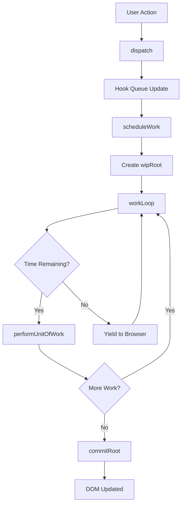

# RyunixJS Architecture

RyunixJS employs a **Fiber-based, concurrent rendering architecture** that splits rendering work into interruptible units, preventing main thread blocking during deep tree updates.

## Core Design Principles

The framework is built around three foundational concepts:

1. **Fiber Reconciler** - Incremental rendering with work-in-progress trees
2. **Priority Scheduling** - Smart task prioritization for optimal responsiveness
3. **Concurrent Mode** - Non-blocking updates with interruptible rendering

<Info>
RyunixJS uses a dual-tree architecture similar to React Fiber, maintaining both a `currentRoot` and `wipRoot` (Work-In-Progress Root) for efficient diffing and updates.
</Info>

## System Components

### Fiber Architecture

Each element in RyunixJS is represented as a **fiber** - a JavaScript object containing:

```javascript
{
  type: element.type,           // Component function or HTML tag
  props: element.props,         // Props including children
  dom: null,                    // Actual DOM node reference
  parent: wipFiber,             // Parent fiber
  child: null,                  // First child fiber
  sibling: null,                // Next sibling fiber
  alternate: matchedFiber,      // Previous fiber for diffing
  effectTag: EFFECT_TAGS.UPDATE,// PLACEMENT, UPDATE, DELETION, HYDRATE
  hooks: [],                    // Hook state array
  key: element.key,             // Reconciliation key
  index: 0                      // Position index
}
```

<Tip>
The `alternate` property enables efficient diffing by maintaining a reference to the previous render's fiber, allowing RyunixJS to compare old and new props.
</Tip>

### Work Loop

The work loop (`workers.js:91`) processes fibers incrementally using `requestIdleCallback`:

```javascript
const workLoop = (deadline) => {
  const state = getState()
  let shouldYield = false

  while ((state.nextUnitOfWork || workQueue.length > 0) && !shouldYield) {
    if (!state.nextUnitOfWork && workQueue.length > 0) {
      const nextRoot = workQueue.shift()
      state.wipRoot = nextRoot
      state.nextUnitOfWork = nextRoot
      state.deletions = []
    }

    if (state.nextUnitOfWork) {
      state.nextUnitOfWork = performUnitOfWork(state.nextUnitOfWork)
    }

    shouldYield = deadline.timeRemaining() < 1
  }

  if (!state.nextUnitOfWork && state.wipRoot) {
    commitRoot()
  }

  if (state.nextUnitOfWork || workQueue.length > 0) {
    rIC(workLoop)
  } else {
    isWorkLoopScheduled = false
  }
}
```

<Note>
The work loop yields to the browser when less than 1ms remains in the idle frame (`shouldYield = deadline.timeRemaining() < 1`), ensuring smooth user interactions.
</Note>

### Render Phases

RyunixJS rendering happens in two distinct phases:

#### 1. Render Phase (Interruptible)

- **Reconciliation**: Compare old and new virtual trees
- **Fiber traversal**: Build work-in-progress tree
- **Effect collection**: Queue side effects for commit
- **Can be paused**: Work is split into units of work

#### 2. Commit Phase (Synchronous)

- **DOM mutations**: Apply all calculated changes
- **Effect execution**: Run layout and normal effects
- **Tree swap**: Update `currentRoot` pointer
- **Cannot be interrupted**: Ensures visual consistency

From `commits.js:92`:

```javascript
function commitRoot() {
  const state = getState()
  state.deletions.forEach(commitWork)

  const finishedWork = state.wipRoot

  // Swap the currentRoot pointer BEFORE running effects
  state.currentRoot = finishedWork

  commitWork(finishedWork.child)

  if (state.wipRoot === finishedWork) {
    state.wipRoot = null
  }
}
```

## Traversal Algorithm

The `performUnitOfWork` function (`workers.js:12`) implements depth-first tree traversal:

```javascript
function performUnitOfWork(fiber) {
  const isFunctionComponent =
    fiber.type instanceof Function || typeof fiber.type === 'function'

  if (isFunctionComponent) {
    updateFunctionComponent(fiber)
  } else {
    updateHostComponent(fiber)
  }

  // Traverse down to child
  if (fiber.child) {
    return fiber.child
  }

  // No child, traverse to sibling
  let nextFiber = fiber
  while (nextFiber) {
    if (nextFiber.sibling) {
      return nextFiber.sibling
    }
    // No sibling, go up to parent
    nextFiber = nextFiber.parent
  }
}
```

<Accordion title="How does the traversal order work?">
1. **Down**: Process current fiber and move to first child
2. **Right**: If no child, move to next sibling
3. **Up**: If no sibling, move up to parent and repeat step 2
4. **Complete**: When no parent exists, traversal is complete

This ensures every fiber is processed exactly once in a predictable order.
</Accordion>

## State Management Flow



## Error Boundary Recovery

RyunixJS includes built-in error recovery (`workers.js:24`):

```javascript
try {
  if (isFunctionComponent) {
    updateFunctionComponent(fiber)
  } else {
    updateHostComponent(fiber)
  }
} catch (error) {
  // Traverse upwards to find nearest ErrorBoundary
  let boundaryFiber = fiber.parent
  let foundBoundary = false

  while (boundaryFiber) {
    if (boundaryFiber.type?.ryunix_type === 'RYUNIX_ERROR_BOUNDARY') {
      foundBoundary = true
      break
    }
    boundaryFiber = boundaryFiber.parent
  }

  if (foundBoundary) {
    boundaryFiber.stateError = error
    fiber.child = null
    return boundaryFiber  // Rewind to boundary
  }
}
```

<Warning>
If no ErrorBoundary is found in the tree, the error is considered fatal and the work loop stops entirely to prevent undefined behavior.
</Warning>

## Performance Optimizations

### Key-Based Reconciliation

RyunixJS uses O(1) map lookups for efficient child reconciliation (`reconciler.js:13`):

```javascript
// Build map of old fibers by key/index
const oldFiberMap = new Map()
let oldFiber = wipFiber.alternate?.child
let position = 0

while (oldFiber) {
  const key = oldFiber.key ?? `__index_${oldFiber.index ?? position}__`
  oldFiberMap.set(key, oldFiber)
  oldFiber = oldFiber.sibling
  position++
}
```

### Incremental Hydration

Server-rendered content is hydrated incrementally, attaching event listeners without re-rendering:

```javascript
if (state.isHydrating && state.hydrateCursor) {
  const domNode = state.hydrateCursor
  const isText = fiber.type === RYUNIX_TYPES.TEXT_ELEMENT && domNode.nodeType === 3
  const isElement = typeof fiber.type === 'string' && 
    domNode.nodeType === 1 && 
    domNode.tagName.toLowerCase() === fiber.type.toLowerCase()

  if (isText || isElement) {
    fiber.dom = domNode
    fiber.effectTag = EFFECT_TAGS.HYDRATE
    state.hydrateCursor = nextValidSibling(domNode.firstChild)
  }
}
```

## Next Steps

<Card title="Virtual DOM & Reconciliation" icon="code-merge" href="/core/virtual-dom-reconciliation">
  Learn how RyunixJS efficiently diffs and updates the virtual tree
</Card>

<Card title="Hooks System" icon="link" href="/core/hooks">
  Explore the comprehensive hooks API and state management
</Card>

<Card title="Priority Scheduling" icon="clock" href="/core/state-priority">
  Understand how RyunixJS prioritizes updates for optimal UX
</Card>