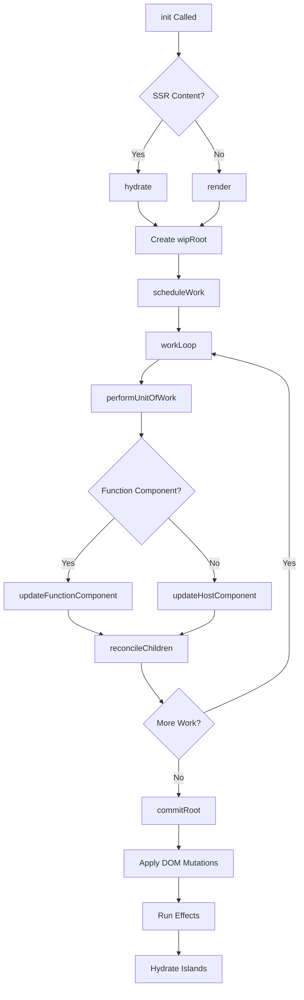

# Rendering Architecture

RyunixJS provides a modern, concurrent rendering model with robust support for **Client-Side Rendering (CSR)**, **Server-Side Rendering (SSR)**, and **Island Architecture**.

## Client-Side Rendering (CSR)

### render()

The entry point for rendering a virtual DOM tree into a physical DOM container.

**From `render.js:17`:**

```javascript
const render = (element, container) => {
  const state = getState()

  // Clear container before CSR render to avoid duplication
  clearContainer(container)

  const root = {
    dom: container,
    props: {
      children: [element],
    },
    alternate: state.currentRoot,
    isHydrating: false,
    hydrateCursor: null,
  }

  scheduleWork(root)
  return root
}
```

**Usage:**

```javascript
import { render } from '@unsetsoft/ryunixjs'
import App from './App'

const container = document.getElementById('root')
render(<App />, container)
```

<Info>
`render()` clears the container before rendering to prevent duplication. It sets up a `wipRoot` (Work-In-Progress Root) and schedules work using `scheduleWork()`.
</Info>

### How render() Works

1. **Clear container**: Remove existing DOM nodes
2. **Create root fiber**: Initialize fiber tree with container as root
3. **Schedule work**: Queue rendering work in the work loop
4. **Reconcile**: Build fiber tree, diff with previous render
5. **Commit**: Apply DOM mutations synchronously

## Hydration

### hydrate()

Attaches Ryunix event listeners and state to existing server-rendered HTML.

**From `render.js:50`:**

```javascript
const hydrate = (element, container) => {
  const state = getState()

  state.containerRoot = container

  const root = {
    dom: container,
    props: {
      children: [element],
    },
    alternate: state.currentRoot,
    isHydrating: true,  // Critical flag
    hydrateCursor: nextValidSibling(container.firstChild),
  }

  scheduleWork(root)
  return root
}
```

**Usage:**

```javascript
import { hydrate } from '@unsetsoft/ryunixjs'
import App from './App'

const container = document.getElementById('root')
hydrate(<App />, container)
```

<Warning>
`hydrate()` preserves existing DOM nodes instead of clearing them. It walks the tree using `hydrateCursor` to match virtual nodes with SSR HTML.
</Warning>

### Hydration Algorithm

From `components.js:53`:

```javascript
if (state.isHydrating && state.hydrateCursor) {
  const domNode = state.hydrateCursor
  const isText = 
    fiber.type === RYUNIX_TYPES.TEXT_ELEMENT && domNode.nodeType === 3
  const isElement = 
    typeof fiber.type === 'string' &&
    domNode.nodeType === 1 &&
    domNode.tagName.toLowerCase() === fiber.type.toLowerCase()

  if (isText || isElement) {
    fiber.dom = domNode  // Reuse SSR node
    fiber.effectTag = EFFECT_TAGS.HYDRATE
    state.hydrateCursor = nextValidSibling(domNode.firstChild)
  } else {
    // Mismatch: Fall back to CSR
    console.warn('[Hydration] Mismatch detected. Falling back to CSR.')
    state.isHydrating = false
    state.hydrationFailed = true
    fiber.dom = createDom(fiber)
    fiber.effectTag = EFFECT_TAGS.PLACEMENT
  }
}
```

**Hydration process:**

1. **Match node type**: Compare virtual fiber with existing DOM node
2. **Reuse DOM**: Assign existing node to `fiber.dom`
3. **Attach listeners**: `updateDom()` adds event listeners without mutation
4. **Move cursor**: Advance to next sibling for next fiber
5. **Mismatch handling**: Fall back to CSR if types don't match

<Accordion title="What happens on hydration mismatch?">
When the client render doesn't match SSR HTML:

1. Warning logged to console (dev mode)
2. `state.isHydrating = false` disables hydration globally
3. `state.hydrationFailed = true` triggers container clear
4. Remaining tree renders as CSR (creates new DOM nodes)

This prevents corrupted DOM state but is expensive. Always ensure SSR/CSR parity.
</Accordion>

### Cleaning Up After Hydration

From `commits.js:116`:

```javascript
if (state.hydrationFailed) {
  const container = state.containerRoot || finishedWork.dom
  if (container) {
    container.textContent = ''  // Clear SSR HTML
  }
} else {
  // Remove unmatched SSR nodes
  let cursor = state.hydrateCursor
  while (cursor) {
    const next = cursor.nextSibling
    if (cursor.parentNode) {
      cursor.parentNode.removeChild(cursor)
    }
    cursor = next
  }
}
```

## Smart Initialization

### init()

Automatically detects whether to use `render()` or `hydrate()`.

**From `render.js:109`:**

```javascript
const init = (MainElement, root = '__ryunix', components = {}) => {
  const state = getState()
  state.containerRoot = document.getElementById(root)

  state.isHydrating = false
  state.hydrationFailed = false

  if (process.env.RYUNIX_SSR && state.containerRoot.hasChildNodes()) {
    // SSR content detected, hydrate
    const res = hydrate(MainElement, state.containerRoot)
    hydrateIslands(components, !!MainElement)
    return res
  }

  // No SSR content, normal render
  const res = render(MainElement, state.containerRoot)
  hydrateIslands(components)
  return res
}
```

**Usage:**

```javascript
import { init } from '@unsetsoft/ryunixjs'
import App from './App'
import { Counter, Modal } from './islands'

init(<App />, 'root', { Counter, Modal })
```

<Tip>
`init()` is the recommended entry point. It handles SSR detection, hydration, and island initialization automatically.
</Tip>

## Island Architecture

RyunixJS supports **Partial Hydration** via Islands - isolated interactive components in mostly-static pages.

### hydrateIslands()

Scans the DOM for `data-ryunix-island` attributes and hydrates them individually.

**From `render.js:80`:**

```javascript
const hydrateIslands = (components = {}, hasMainElement = false) => {
  if (typeof window === 'undefined') return
  const elements = document.querySelectorAll('[data-ryunix-island]')
  const globalRegistry = window.__RYUNIX_ISLANDS__ || {}

  elements.forEach((container) => {
    // Skip islands managed by main element unless in ServerBoundary
    if (hasMainElement && !container.closest('[data-ryunix-server]')) {
      return
    }

    const id = container.getAttribute('data-ryunix-island')
    const Component = components[id] || globalRegistry[id]
    if (!Component) {
      console.warn(`[Ryunix Islands] Component "${id}" not found.`)
      return
    }

    try {
      const props = JSON.parse(container.getAttribute('data-props') || '{}')
      hydrate(createElement(Component, props), container)
    } catch (e) {
      console.error(`[Ryunix Islands] Error hydrating island "${id}":`, e)
    }
  })
}
```

### Island HTML Structure

Server-rendered island:

```html
<div data-ryunix-island="Counter" data-props='{"initial":0}'>
  <!-- SSR HTML of Counter component -->
  <div>
    <p>Count: 0</p>
    <button>Increment</button>
  </div>
</div>
```

Client-side hydration:

```javascript
import { hydrateIslands } from '@unsetsoft/ryunixjs'
import Counter from './islands/Counter'

// Manual hydration
hydrateIslands({ Counter })

// Or use init() which calls hydrateIslands automatically
init(null, 'root', { Counter })
```

<Info>
Islands ship minimal JavaScript by only hydrating specific dynamic components. The rest of the page remains static HTML.
</Info>

### ServerBoundary Integration

Islands inside `ServerBoundary` are never hydrated by the main app:

```javascript
if (hasMainElement && !container.closest('[data-ryunix-server]')) {
  return  // Skip this island
}
```

**Example:**

```javascript
function BlogPost() {
  return (
    <div>
      <InteractiveNav />  {/* Hydrated by main app */}
      <ServerBoundary>
        <StaticContent />  {/* Never hydrated */}
        <div data-ryunix-island="Comments">
          <Comments />  {/* Hydrated independently */}
        </div>
      </ServerBoundary>
    </div>
  )
}
```

## Server-Side Rendering (SSR)

### renderToString()

Synchronously renders a virtual tree to an HTML string.

```javascript
import { renderToString } from '@unsetsoft/ryunixjs/server'
import App from './App'

const html = renderToString(<App />)

const fullHTML = `
<!DOCTYPE html>
<html>
  <head>
    <title>My App</title>
  </head>
  <body>
    <div id="root">${html}</div>
    <script src="/client.js"></script>
  </body>
</html>
`
```

**Features:**
- Escapes HTML characters to prevent XSS
- Injects necessary attributes
- Synchronous: Blocks until complete
- Best for simple, static pages

### renderToReadableStream()

Asynchronously renders to a Web `ReadableStream` for streaming SSR.

```javascript
import { renderToReadableStream } from '@unsetsoft/ryunixjs/server'
import App from './App'

export default async function handler(req, res) {
  const stream = await renderToReadableStream(<App />)
  
  res.setHeader('Content-Type', 'text/html')
  res.write('<!DOCTYPE html><html><body><div id="root">')
  
  const reader = stream.getReader()
  while (true) {
    const { done, value } = await reader.read()
    if (done) break
    res.write(value)
  }
  
  res.write('</div><script src="/client.js"></script></body></html>')
  res.end()
}
```

**Features:**
- Out-of-order streaming with Suspense
- Early flush for faster First Contentful Paint
- Handles async components natively
- Streams `<template>` tags for late-resolved content

<Accordion title="How does streaming work with Suspense?">
When `renderToReadableStream` encounters a `Suspense` boundary:

1. **Immediate**: Stream the `fallback` HTML
2. **Background**: Start loading the async component
3. **Completion**: When ready, stream a `<template id="B:X">` with the content
4. **Client**: A tiny `$RC` function swaps the template into place

This enables **out-of-order streaming** - fast content appears first, slow content fills in later.
</Accordion>

## Rendering Flow Diagram



## Performance Optimizations

### 1. Incremental Hydration

Hydrate islands only when needed:

```javascript
function LazyIsland() {
  useEffect(() => {
    // Hydrate on user interaction
    const hydrate = () => {
      hydrateIslands({ HeavyComponent })
    }
    window.addEventListener('scroll', hydrate, { once: true })
  }, [])

  return <div data-ryunix-island="HeavyComponent">...</div>
}
```

### 2. Streaming SSR

Use `renderToReadableStream` for better Time to First Byte:

```javascript
const stream = await renderToReadableStream(
  <Suspense fallback={<Skeleton />}>
    <SlowComponent />
  </Suspense>
)
// Skeleton streams immediately, SlowComponent fills in later
```

### 3. Selective Hydration

Only hydrate interactive parts:

```javascript
// Static content, no hydration needed
<ServerBoundary>
  <article>{markdownContent}</article>
</ServerBoundary>

// Interactive, hydrate this
<div data-ryunix-island="CommentSection">
  <CommentSection />
</div>
```

## Best Practices

<Card title="SSR/CSR Parity" icon="balance-scale">
  Ensure server and client render identical HTML to avoid hydration mismatches. Avoid using browser APIs during initial render.
</Card>

<Card title="Island Architecture" icon="island-tropical">
  Use islands for heavy interactive components in mostly-static pages. This dramatically reduces JavaScript bundle size.
</Card>

<Card title="Streaming SSR" icon="stream">
  Prefer `renderToReadableStream` over `renderToString` for faster perceived performance and better UX.
</Card>

## Common Patterns

### Full CSR

```javascript
import { render } from '@unsetsoft/ryunixjs'
import App from './App'

render(<App />, document.getElementById('root'))
```

### SSR + Hydration

**Server:**

```javascript
import { renderToString } from '@unsetsoft/ryunixjs/server'
const html = renderToString(<App />)
```

**Client:**

```javascript
import { hydrate } from '@unsetsoft/ryunixjs'
hydrate(<App />, document.getElementById('root'))
```

### Island Architecture

**Server:**

```html
<article>Static content...</article>
<div data-ryunix-island="Counter" data-props='{"initial":0}'>...</div>
```

**Client:**

```javascript
import { init } from '@unsetsoft/ryunixjs'
import Counter from './islands/Counter'

init(null, 'root', { Counter })
```

### Hybrid (Main App + Islands)

```javascript
import { init } from '@unsetsoft/ryunixjs'
import App from './App'
import { Counter, Comments } from './islands'

// Hydrates main app + any islands not managed by app
init(<App />, 'root', { Counter, Comments })
```

## Debugging

Enable debug logging:

```bash
RYUNIX_DEBUG=true npm run dev
```

Logs include:
- Hydration start/complete
- Mismatch warnings
- Island hydration status
- Work loop timing

## Next Steps

<Card title="Virtual DOM" icon="code-merge" href="/core/virtual-dom-reconciliation">
  Learn how reconciliation and diffing work
</Card>

<Card title="Components" icon="cube" href="/core/components">
  Explore ServerBoundary, Suspense, and lazy loading
</Card>

<Card title="Architecture" icon="sitemap" href="/core/architecture">
  Deep dive into fiber architecture and work loop
</Card>